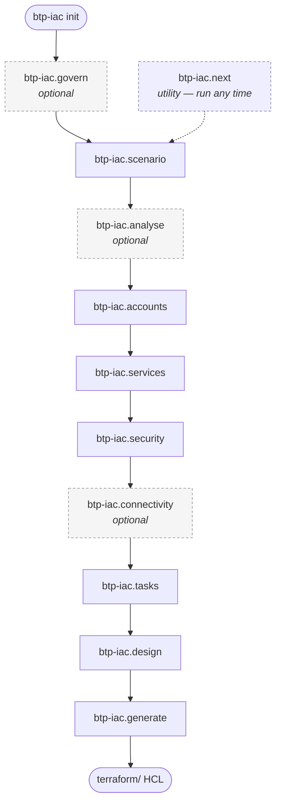

# Usage

The CLI exposes a single command, `btp-iac init`, which scaffolds a new project. All subsequent work happens inside your AI agent through the generated `btp-iac.*` commands.

## `btp-iac init`

```
btp-iac init [name] [--agent claude,codex,cursor,copilot]
```

Bootstraps a new BTP IaC project in a directory named `[name]`.

### Argument

| Argument | Description |
|---|---|
| `[name]` | Optional. The project directory to use. In an interactive terminal, omitting it opens a menu to create a new project, adopt the current directory, or add/update agents in an existing project. In a non-interactive context (no TTY, such as CI) the command cannot prompt, so the name must be passed explicitly. |

### Flag

| Flag | Description |
|---|---|
| `--agent` | Comma-separated list of AI agents to configure: `claude`, `codex`, `cursor`, `copilot`. When omitted **in a terminal**, `init` shows an interactive multi-select. When omitted **without a TTY**, `init` reports an error asking you to pass `--agent`. An unknown agent id is rejected. |

### Examples

```sh
# Interactive: prompts for agents (and for the name if omitted)
btp-iac init my-btp-project

# Configure for Claude Code
btp-iac init my-btp-project --agent claude

# Configure for multiple agents
btp-iac init my-btp-project --agent claude,cursor

# Non-interactive (CI): name and --agent are both required
btp-iac init my-btp-project --agent claude,codex
```

## What `init` creates

```
my-btp-project/
├── .gitignore            # ignores .terraform/, *.tfstate, *.tfstate.backup,
│                         # .terraform.lock.hcl, .btp-iac/platform-validation.md,
│                         # and memory/global-account.md
├── specs/                # (empty) requirement specs the agent commands write
├── memory/               # global-account.md is written at init; governance.md
│                         # is authored later by btp-iac.govern
│   └── global-account.md # the global-account subdomain entered at init (optional)
├── terraform/            # (empty) generated Terraform HCL lands here
├── .btp-iac/             # internal state (platform-validation.md)
└── <agent command dir>/  # one per selected agent (see below)
```

During a fresh init (and when adopting an existing directory), `init` also prompts for an optional **global-account subdomain** and records it in `memory/global-account.md`. When `git` is available, `init` runs `git init` in the new directory.

!!! warning "Existing projects are updated, not overwritten"
    Running `init` against an existing directory does not error. If the directory is already a btp-iac project (it has `specs/` or `memory/`), `init` only adds or updates the selected agents' command files, leaving your specs and memory untouched. If it is some other existing directory, `init` adopts it — scaffolding the project structure in place.

### Agent command directories

Each selected agent receives a directory of `btp-iac.<skill>` command files — one per skill: `govern`, `scenario`, `analyse`, `accounts`, `services`, `security`, `connectivity`, `tasks`, `design`, `generate`, and the `next` utility.

| Agent | Directory | File extension |
|---|---|---|
| `claude` | `.claude/commands/` | `.md` |
| `codex` | `.codex/prompts/` | `.md` |
| `cursor` | `.cursor/rules/` | `.mdc` |
| `copilot` | `.github/instructions/` | `.instructions.md` |

For example, `--agent claude` produces `.claude/commands/btp-iac.scenario.md`, `.claude/commands/btp-iac.generate.md`, and so on.

## MCP and platform-validation checks

During `init`, the CLI checks whether your agent has an MCP server configured for **Terraform/OpenTofu**, and whether a **BTP CLI or BTP MCP** route is available for platform validation. Each missing capability prints an advisory warning, for example:

```
[claude] No Terraform or OpenTofu MCP server detected.
Terraform operations in your AI agent may not work.
```

```
[claude] No BTP CLI or BTP MCP server detected. Platform validation will use user input without blocking.
```

!!! info "Advisory only"
    These checks never stop `init`. Configuring the servers is what lets the agent actually run Terraform and validate against your BTP account; setting them up is your responsibility.

## The agent workflow

After `init`, open the project in your AI agent and run the commands in order:



| Step | Command | Purpose |
|---|---|---|
| ○ | `btp-iac.govern` | *Optional.* Set guardrails — regions, naming, cost policies. Skip to use defaults. |
| 1 | `btp-iac.scenario` | Describe your application. |
| 2 | `btp-iac.analyse` | *Optional.* Scan source or Terraform code to extract service dependencies. |
| 3 | `btp-iac.accounts` | Map your application to BTP directories and subaccounts. |
| 4 | `btp-iac.services` | Resolve which BTP services each subaccount needs. |
| 5 | `btp-iac.security` | Set up IdP trust, role collections, and role-collection assignments. |
| 6 | `btp-iac.connectivity` | *Optional.* Define destinations and certificates for external/on-premise systems. |
| 7 | `btp-iac.tasks` | Build a dependency-ordered execution plan. |
| 8 | `btp-iac.design` | Plan the Terraform file and module layout. |
| 9 | `btp-iac.generate` | Write and validate all Terraform HCL. |
| — | `btp-iac.next` | *Utility.* Show the current project state and recommend the next command. Run any time. |

Each command reads and writes files under `specs/`, `memory/`, and `terraform/`. For a detailed description of every command — its inputs, outputs, and governance behaviour — see the [command reference](commands/index.md). For a concrete run-through, see the [usage walkthrough](walkthrough.md).
